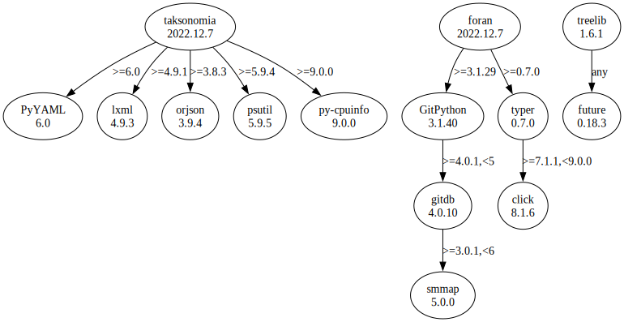

# Third Party Dependencies

<!--[[[fill sbom_sha256()]]]-->
The [SBOM in CycloneDX v1.4 JSON format](https://git.sr.ht/~sthagen/navigaattori/blob/default/sbom.json) with SHA256 checksum ([e3b0c442 ...](https://git.sr.ht/~sthagen/navigaattori/blob/default/sbom.json.sha256 "sha256:e3b0c44298fc1c149afbf4c8996fb92427ae41e4649b934ca495991b7852b855")).
<!--[[[end]]]-->
## Licenses 

JSON files with complete license info of: [direct dependencies](direct-dependency-licenses.json) | [all dependencies](all-dependency-licenses.json)

### Direct Dependencies

<!--[[[fill direct_dependencies_table()]]]-->
| Name                                                | Version                                                     | License                 | Author            | Description (from packaging data)                                                                                                         |
|:----------------------------------------------------|:------------------------------------------------------------|:------------------------|:------------------|:------------------------------------------------------------------------------------------------------------------------------------------|
| [PyYAML](https://pyyaml.org/)                       | [6.0](https://pypi.org/project/PyYAML/6.0/)                 | MIT License             | Kirill Simonov    | YAML parser and emitter for Python                                                                                                        |
| [foran](https://git.sr.ht/~sthagen/foran)           | [2022.12.7](https://pypi.org/project/foran/2022.12.7/)      | MIT License             | Stefan Hagen      | In front or behind (Danish: foran eller bagved)? Answering the question if a local repository status is in front of or behind its remote. |
| [taksonomia](https://git.sr.ht/~sthagen/taksonomia) | [2022.12.7](https://pypi.org/project/taksonomia/2022.12.7/) | MIT License             | Stefan Hagen      | Taxonomy (Finnish: taksonomia) of a folder tree, guided by conventions.                                                                   |
| [treelib](https://github.com/caesar0301/treelib)    | [1.6.1](https://pypi.org/project/treelib/1.6.1/)            | Apache Software License | Xiaming Chen      | A Python 2/3 implementation of tree structure.                                                                                            |
| [typer](https://github.com/tiangolo/typer)          | [0.7.0](https://pypi.org/project/typer/0.7.0/)              | MIT License             | Sebastián Ramírez | Typer, build great CLIs. Easy to code. Based on Python type hints.                                                                        |
<!--[[[end]]] (checksum: c7a92d691e1833e1c5be514cbb5d3a51)-->

### Indirect Dependencies

<!--[[[fill indirect_dependencies_table()]]]-->
| Name                                                           | Version                                              | License                              | Author                         | Description (from packaging data)                                                                |
|:---------------------------------------------------------------|:-----------------------------------------------------|:-------------------------------------|:-------------------------------|:-------------------------------------------------------------------------------------------------|
| [GitPython](https://github.com/gitpython-developers/GitPython) | [3.1.29](https://pypi.org/project/GitPython/3.1.29/) | BSD License                          | Sebastian Thiel, Michael Trier | GitPython is a python library used to interact with Git repositories                             |
| [click](https://palletsprojects.com/p/click/)                  | [8.1.3](https://pypi.org/project/click/8.1.3/)       | BSD License                          | Armin Ronacher                 | Composable command line interface toolkit                                                        |
| [future](https://python-future.org)                            | [0.18.2](https://pypi.org/project/future/0.18.2/)    | MIT License                          | Ed Schofield                   | Clean single-source support for Python 3 and 2                                                   |
| [gitdb](https://github.com/gitpython-developers/gitdb)         | [4.0.9](https://pypi.org/project/gitdb/4.0.9/)       | BSD License                          | Sebastian Thiel                | Git Object Database                                                                              |
| [lxml](https://lxml.de/)                                       | [4.9.1](https://pypi.org/project/lxml/4.9.1/)        | BSD License                          | lxml dev team                  | Powerful and Pythonic XML processing library combining libxml2/libxslt with the ElementTree API. |
| [orjson](https://github.com/ijl/orjson)                        | [3.8.3](https://pypi.org/project/orjson/3.8.3/)      | Apache Software License; MIT License | ijl <ijl@mailbox.org>          | Fast, correct Python JSON library supporting dataclasses, datetimes, and numpy                   |
| [psutil](https://github.com/giampaolo/psutil)                  | [5.9.4](https://pypi.org/project/psutil/5.9.4/)      | BSD License                          | Giampaolo Rodola               | Cross-platform lib for process and system monitoring in Python.                                  |
| [py-cpuinfo](https://github.com/workhorsy/py-cpuinfo)          | [9.0.0](https://pypi.org/project/py-cpuinfo/9.0.0/)  | MIT License                          | Matthew Brennan Jones          | Get CPU info with pure Python                                                                    |
| [smmap](https://github.com/gitpython-developers/smmap)         | [5.0.0](https://pypi.org/project/smmap/5.0.0/)       | BSD License                          | Sebastian Thiel                | A pure Python implementation of a sliding window memory map manager                              |
<!--[[[end]]] (checksum: 3d02f06151e3afa56550273f68c08816)-->

## Dependency Tree(s)

JSON file with the complete package dependency tree info of: [the full dependency tree](package-dependency-tree.json)

### Rendered SVG

Base graphviz file in dot format: [Trees of the direct dependencies](package-dependency-tree.dot.txt)



### Console Representation

<!--[[[fill dependency_tree_console_text()]]]-->
````console
foran==2022.12.7
  - GitPython [required: >=3.1.29, installed: 3.1.29]
    - gitdb [required: >=4.0.1,<5, installed: 4.0.9]
      - smmap [required: >=3.0.1,<6, installed: 5.0.0]
  - typer [required: >=0.7.0, installed: 0.7.0]
    - click [required: >=7.1.1,<9.0.0, installed: 8.1.3]
taksonomia==2022.12.7
  - lxml [required: >=4.9.1, installed: 4.9.1]
  - orjson [required: >=3.8.3, installed: 3.8.3]
  - psutil [required: >=5.9.4, installed: 5.9.4]
  - py-cpuinfo [required: >=9.0.0, installed: 9.0.0]
  - PyYAML [required: >=6.0, installed: 6.0]
treelib==1.6.1
  - future [required: Any, installed: 0.18.2]
````
<!--[[[end]]] (checksum: 0820c298355dc89c92ea9c4d8bffad69)-->
